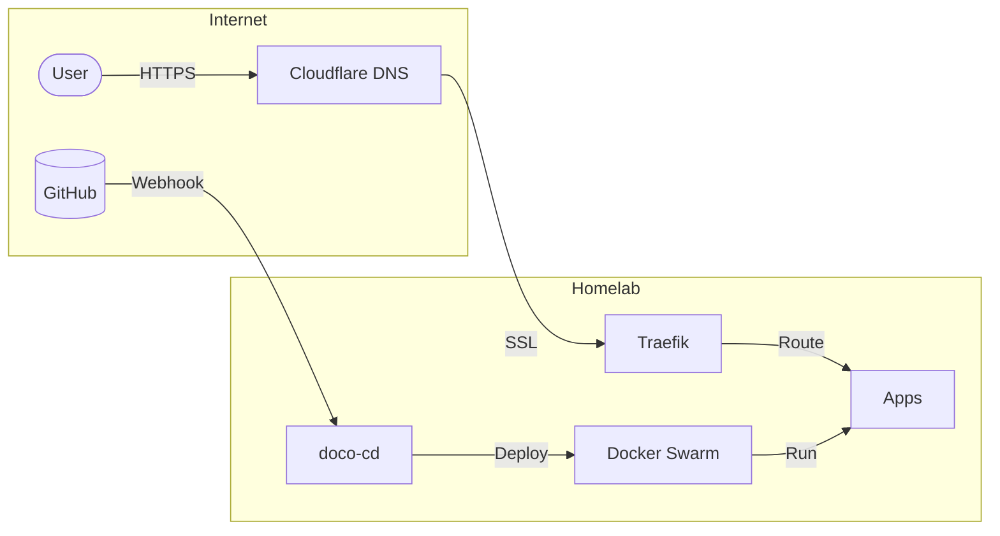

# home-ops


[](https://docs.docker.com/engine/swarm/)
[](https://traefik.io)
[](https://github.com/renovatebot/renovate)
[](https://github.com/getsops/sops)

GitOps-driven homelab running on Docker Swarm


## Overview



[Docker Swarm](https://docs.docker.com/engine/swarm/) orchestrates containers across nodes. [Traefik](https://traefik.io) handles reverse proxy with automatic Let's Encrypt SSL via Cloudflare DNS. [doco-cd](https://github.com/kimdre/doco-cd) watches this repo and deploys on webhook with zero-downtime rolling updates. Secrets encrypted with [SOPS](https://github.com/getsops/sops). [Renovate](https://github.com/renovatebot/renovate) auto-updates dependencies.

**Deploy Flow:**
```
public:  git push → webhook → doco-cd → deploy
private: push tag → build → update home-ops → deploy
```

Private apps use [doco-deploy-workflow](https://github.com/wajeht/doco-deploy-workflow) for instant deploys.


## Hardware

| Device | RAM | Storage | OS | Function |
|--------|-----|---------|----|---------|
| Dell OptiPlex 5050 | 32GB | 1TB SSD | Ubuntu 24.04 | Docker Swarm |
| Dell OptiPlex 7050 | 32GB | 1TB SSD | Ubuntu 22.04 | Docker Swarm |
| Raspberry Pi 5 + PoE HAT | 8GB | 128GB SD | Raspberry Pi OS | AdGuard |
| Synology DS423+ | 4GB | 25TB SHR | DSM | NAS |
| UniFi Cloud Gateway Ultra | 3GB | 16GB | UniFi OS | Router |
| UniFi U6+ | - | - | - | WiFi 6 AP |
| TP-Link TL-SG608P | - | - | - | PoE Switch |
| CyberPower 1500VA AVR | - | - | - | UPS |

## Docs

- [Quick Start](docs/quick-start.md)
- [Disaster Recovery](docs/disaster-recovery.md)
- [Adding Apps](docs/adding-apps.md)
- [SSL Setup](docs/ssl.md)
- [Secrets](docs/secrets.md)


## License

Distributed under the MIT License © [wajeht](https://github.com/wajeht). See [LICENSE](./LICENSE) for more information.
