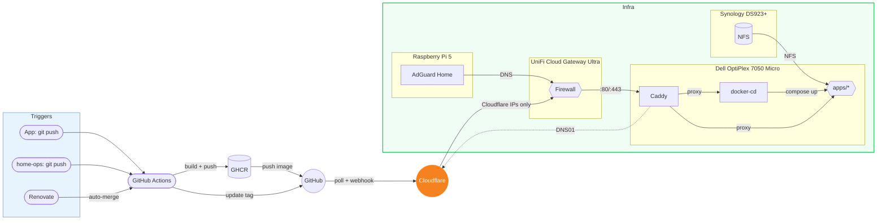

# home-ops

GitOps-driven homelab running on Docker Compose

## Overview

Push to git, [docker-cd](https://github.com/wajeht/docker-cd) auto-deploys. Polls every 5 min or instantly via `/api/sync` webhook. Auto-discovers all stacks in `apps/`, decrypts [SOPS](https://github.com/getsops/sops) secrets, and deploys with rolling updates. [Caddy](https://github.com/wajeht/docker-cd-caddy) routes via Docker labels with auto SSL via Cloudflare DNS challenge. [Renovate](https://github.com/renovatebot/renovate) keeps third-party deps updated (~15min: Renovate scan + docker-cd poll). Own images use [docker-cd-deploy-workflow](https://github.com/wajeht/docker-cd-deploy-workflow) which triggers `/api/sync` for instant deploy (~1min).

## Hardware

| Device                                                                                                                                                                                                                                                          | RAM  | Storage  | OS              | Function    |
| --------------------------------------------------------------------------------------------------------------------------------------------------------------------------------------------------------------------------------------------------------------- | ---- | -------- | --------------- | ----------- |
| [Dell OptiPlex 7050 Micro (i7-7700)](https://www.amazon.com/s?k=dell+optiplex+7050+micro+i7-7700)                                                                                                                                                               | 32GB | 1TB SSD  | Ubuntu 24.04    | Docker Host |
| [Raspberry Pi 5](https://www.raspberrypi.com/products/raspberry-pi-5/) + [GeeekPi P33 NVMe PoE+ HAT](https://www.amazon.com/dp/B0DMW98LBR)                                                                                                                      | 8GB  | 128GB SD | Raspberry Pi OS | AdGuard     |
| [Synology DS923+](https://www.amazon.com/dp/B0BM7KDN6R) &nbsp;&nbsp;&nbsp;&nbsp;— [WD Red Plus 8TB](https://www.amazon.com/s?k=WD+Red+Plus+8TB) x2 &nbsp;&nbsp;&nbsp;&nbsp;— [Seagate IronWolf 12TB](https://www.amazon.com/s?k=Seagate+IronWolf+12TB) x2 | 4GB  | 25TB SHR | DSM             | NAS         |
| [UniFi Cloud Gateway Ultra](https://store.ui.com/us/en/products/ucg-ultra)                                                                                                                                                                                      | 3GB  | 16GB     | UniFi OS        | Firewall    |
| [UniFi U6+](https://store.ui.com/us/en/products/u6-plus)                                                                                                                                                                                                        | -    | -        | -               | WiFi 6 AP   |
| [TP-Link TL-SG608P](https://www.amazon.com/s?k=TP-Link+TL-SG608P)                                                                                                                                                                                               | -    | -        | -               | PoE Switch  |
| [CyberPower 1500VA AVR](https://www.amazon.com/CyberPower-CP1500AVRLCD-Intelligent-Outlets-Mini-Tower/dp/B000FBK3QK)                                                                                                                                            | -    | -        | -               | UPS         |

With all equipment connected: 69W idle @ 120V, 145 min UPS runtime, 50 kWh/mo (~$6/mo).

## Docs

- [Quick Start](docs/quick-start.md)
- [Adding Apps](docs/adding-apps.md)
- [Secrets](docs/secrets.md)
- [SSL Setup](docs/ssl.md)
- [Renovate](docs/renovate.md)
- [Instant Deploy](docs/instant-deploy.md)
- [Disaster Recovery](docs/disaster-recovery.md)

## License

Distributed under the MIT License © [wajeht](https://github.com/wajeht). See [LICENSE](./LICENSE) for more information.
