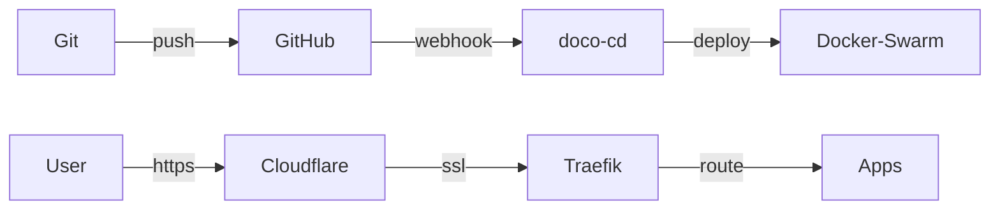

# home-ops


[](https://docs.docker.com/engine/swarm/)
[](https://traefik.io)
[](https://github.com/renovatebot/renovate)
[](https://github.com/getsops/sops)

GitOps-driven homelab running on Docker Swarm


## Overview



Push to git, [doco-cd](https://github.com/kimdre/doco-cd) auto-deploys. Two instances: one for `apps/swarm/` (Swarm, zero-downtime), one for `apps/compose/` (Compose, device access). [Traefik](https://traefik.io) routes with auto SSL via Cloudflare. Secrets encrypted with [SOPS](https://github.com/getsops/sops). [Renovate](https://github.com/renovatebot/renovate) keeps deps updated.


## Hardware

| Device | RAM | Storage | OS | Function |
|--------|-----|---------|----|---------|
| [Dell OptiPlex 5050 Micro](https://www.amazon.com/s?k=dell+optiplex+5050+micro) | 32GB | 1TB SSD | Ubuntu 24.04 | Docker Swarm |
| [Dell OptiPlex 7050 Micro](https://www.amazon.com/s?k=dell+optiplex+7050+micro) | 32GB | 1TB SSD | Ubuntu 22.04 | Docker Swarm |
| [Raspberry Pi 5 + PoE HAT](https://www.raspberrypi.com/products/raspberry-pi-5/) | 8GB | 128GB SD | Raspberry Pi OS | AdGuard |
| [Synology DS923+](https://www.amazon.com/dp/B0BM7KDN6R) | 4GB | 25TB SHR | DSM | NAS |
| [WD Red Plus 8TB](https://www.amazon.com/s?k=WD+Red+Plus+8TB) x2 | - | - | - | NAS Drives |
| [Seagate IronWolf 12TB](https://www.amazon.com/s?k=Seagate+IronWolf+12TB) x2 | - | - | - | NAS Drives |
| [UniFi Cloud Gateway Ultra](https://store.ui.com/us/en/products/ucg-ultra) | 3GB | 16GB | UniFi OS | Firewall |
| [UniFi U6+](https://store.ui.com/us/en/products/u6-plus) | - | - | - | WiFi 6 AP |
| [TP-Link TL-SG608P](https://www.amazon.com/s?k=TP-Link+TL-SG608P) | - | - | - | PoE Switch |
| [CyberPower 1500VA AVR](https://www.amazon.com/CyberPower-CP1500AVRLCD-Intelligent-Outlets-Mini-Tower/dp/B000FBK3QK) | - | - | - | UPS |

With all equipment connected: 82W idle, 2 hr UPS runtime, 60 kWh/mo ($7/mo).

## Structure

```
apps/
├── swarm/           # Swarm stacks (auto via doco-cd)
│   ├── traefik/
│   ├── authelia/
│   ├── doco-cd/     # Deploys apps/swarm/ as Swarm
│   ├── homepage/
│   ├── media/
│   └── ...
└── compose/         # Compose services (auto via doco-cd)
    ├── doco-cd/     # Deploys apps/compose/ as Compose
    ├── plex/        # Needs /dev/dri for hardware transcoding
    └── vpn-qbit/    # Needs /dev/net/tun for VPN
```

## Docs

- [Quick Start](docs/quick-start.md)
- [Disaster Recovery](docs/disaster-recovery.md)
- [Adding Apps](docs/adding-apps.md)
- [SSL Setup](docs/ssl.md)
- [Secrets](docs/secrets.md)


## License

Distributed under the MIT License © [wajeht](https://github.com/wajeht). See [LICENSE](./LICENSE) for more information.
