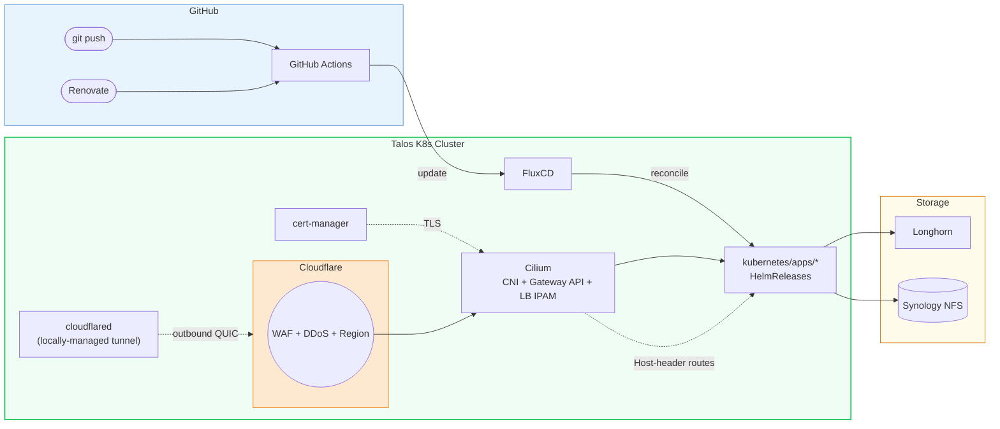

# home-ops

> **Status:** Migrating from Docker Compose (docker-cd) on `main` to Kubernetes (this `talos` branch). See [docs/kubernetes.md](docs/kubernetes.md) for the plan.

GitOps-driven homelab running on Talos Linux + Kubernetes.

Push to git, [FluxCD](https://fluxcd.io/) reconciles the cluster — auto-discovers `kubernetes/apps/`, decrypts [SOPS](https://github.com/getsops/sops) secrets, applies HelmReleases. [Cilium](https://cilium.io/) handles networking, traffic routing (via Gateway API), and LB IPAM. [cert-manager](https://cert-manager.io/) issues wildcard TLS via Cloudflare DNS. [Renovate](https://github.com/renovatebot/renovate) keeps deps fresh. PVC backups via [Volsync](https://volsync.readthedocs.io/) (Restic under the hood) to NAS, with restore-on-PVC-create for easy disaster recovery.

```mermaid
flowchart LR
    subgraph repos["GitHub"]
        push([git push])
        renovate([Renovate])
        gha[GitHub Actions]
    end

    subgraph cf[Cloudflare]
        waf((WAF + DDoS + Region))
    end

    subgraph cluster["Talos K8s Cluster"]
        flux[FluxCD]
        cilium["Cilium
        CNI + Gateway API + LB IPAM"]
        cert[cert-manager]
        cfd["cloudflared
        (locally-managed tunnel)"]
        apps["kubernetes/apps/*
        HelmReleases"]
        flux -->|reconcile| apps
        cilium --> apps
        cert -.->|TLS| cilium
        cfd -.->|outbound QUIC| cf
        cilium -.->|Host-header routes| apps
    end

    subgraph storage["Storage"]
        longhorn[Longhorn]
        nfs[(Synology NFS)]
    end

    push --> gha -->|update| flux
    renovate --> gha
    waf --> cilium
    apps --> longhorn
    apps --> nfs

    style repos fill:#e8f4fd,stroke:#4a90d9
    style cluster fill:#f0fdf4,stroke:#22c55e,stroke-width:2px
    style cf fill:#fde8d0,stroke:#f6821f
    style storage fill:#fffbeb,stroke:#d97706
```

## Hardware

| Device                                                                                                                                                                                                                                                                                                                                                                                                                                                    | RAM  | Storage  | OS              | Function              |
| --------------------------------------------------------------------------------------------------------------------------------------------------------------------------------------------------------------------------------------------------------------------------------------------------------------------------------------------------------------------------------------------------------------------------------------------------------- | ---- | -------- | --------------- | --------------------- |
| [Dell OptiPlex 7050 Micro (i7-7700)](https://www.amazon.com/s?k=dell+optiplex+7050+micro+i7-7700) &nbsp;&nbsp;&nbsp;&nbsp;— [WD Blue SN570 1TB NVMe](https://www.amazon.com/s?k=WD+Blue+SN570+1TB) (OS + apps) &nbsp;&nbsp;&nbsp;&nbsp;— [Micron M600 1TB SATA](https://www.amazon.com/s?k=Micron+M600+1TB) &nbsp;&nbsp;&nbsp;&nbsp;— [Intel I226-V 2.5GbE M.2 NIC](https://www.amazon.com/s?k=Intel+I226-V+2.5G+M.2+A%2BE+2230)                 | 32GB | 2TB      | Ubuntu 24.04    | docker-cd (migrating) |
| [Dell OptiPlex 5050 Micro (i7-6700)](https://www.amazon.com/s?k=dell+optiplex+5050+micro+i7-6700) &nbsp;&nbsp;&nbsp;&nbsp;— [Micron 1100 1TB SATA](https://www.amazon.com/s?k=Micron+1100+1TB) (OS) &nbsp;&nbsp;&nbsp;&nbsp;— [Intel I226-V 2.5GbE M.2 NIC](https://www.amazon.com/s?k=Intel+I226-V+2.5G+M.2+A%2BE+2230)                                                                                                                            | 32GB | 1TB      | Talos v1.12.6   | K8s Control Plane     |
| [Dell OptiPlex 7070 Micro (i7-9700T)](https://www.amazon.com/s?k=dell+optiplex+7070+micro+i7-9700t) &nbsp;&nbsp;&nbsp;&nbsp;— [WD Black SN730 256GB NVMe](https://www.amazon.com/s?k=WD+Black+SN730+256GB) (OS) &nbsp;&nbsp;&nbsp;&nbsp;— [SanDisk SSD 1TB SATA](https://www.amazon.com/s?k=SanDisk+SDSSDH3+1TB) (Longhorn) &nbsp;&nbsp;&nbsp;&nbsp;— [Intel I226-V 2.5GbE M.2 NIC](https://www.amazon.com/s?k=Intel+I226-V+2.5G+M.2+A%2BE+2230) | 32GB | 1.25TB   | Talos v1.12.6   | K8s Worker            |
| [Raspberry Pi 5](https://www.raspberrypi.com/products/raspberry-pi-5/) &nbsp;&nbsp;&nbsp;&nbsp;— [GeeekPi P33 NVMe PoE+ HAT](https://www.amazon.com/dp/B0DMW98LBR)                                                                                                                                                                                                                                                                                     | 8GB  | 128GB SD | Raspberry Pi OS | AdGuard               |
| [Synology DS923+](https://www.amazon.com/dp/B0BM7KDN6R) &nbsp;&nbsp;&nbsp;&nbsp;— [WD Red Plus 8TB](https://www.amazon.com/s?k=WD+Red+Plus+8TB) x2 &nbsp;&nbsp;&nbsp;&nbsp;— [Seagate IronWolf 12TB](https://www.amazon.com/s?k=Seagate+IronWolf+12TB) x2 &nbsp;&nbsp;&nbsp;&nbsp;— [Synology E10G22-T1-Mini 10GbE NIC](https://www.amazon.com/s?k=Synology+E10G22-T1-Mini)                                                                      | 20GB | 25TB SHR | DSM             | NAS                   |
| [UniFi Cloud Gateway Fiber](https://store.ui.com/us/en/products/ucg-fiber) &nbsp;&nbsp;&nbsp;&nbsp;— [Samsung 990 EVO Plus 1TB NVMe](https://www.amazon.com/s?k=Samsung+990+EVO+Plus+1TB) &nbsp;&nbsp;&nbsp;&nbsp;— [UACC SSD Tray](https://store.ui.com/us/en/category/accessories-installations/collections/drive-trays/products/uacc-ssd-tray)                                                                                                   | 3GB  | 1TB      | UniFi OS        | Firewall              |
| [UniFi U6+](https://store.ui.com/us/en/products/u6-plus)                                                                                                                                                                                                                                                                                                                                                                                                  | -    | -        | -               | WiFi 6 AP             |
| [UniFi UNVR Instant](https://store.ui.com/us/en/products/unvr-instant) &nbsp;&nbsp;&nbsp;&nbsp;— [UniFi Basic 3.5" HDD 4TB](https://store.ui.com/us/en/products/uacc-hdd-s-4tb) &nbsp;&nbsp;&nbsp;&nbsp;— [UniFi Camera G6 Instant](https://store.ui.com/us/en/products/uvc-g6-ins)                                                                                                                                                                 | 4GB  | 4TB      | UniFi OS        | NVR / Camera          |
| [SMLIGHT SLZB-MR3U](https://www.amazon.com/dp/B0FB97W6CN) &nbsp;&nbsp;&nbsp;&nbsp;— [THIRDREALITY Smart Plug Gen3](https://www.amazon.com/dp/B0GHQT8TQ8) x4 &nbsp;&nbsp;&nbsp;&nbsp;— [THIRDREALITY Smart Switch](https://www.amazon.com/dp/B0CR9ZSV5L) x2                                                                                                                                                                                          | -    | -        | -               | Zigbee Gateway        |
| [UniFi Flex 2.5G PoE 8-Port](https://store.ui.com/us/en/products/usw-flex-2-5g-8-poe)                                                                                                                                                                                                                                                                                                                                                                     | -    | -        | -               | PoE Switch            |
| [ElecVoztile 10" Rack PDU](https://www.amazon.com/dp/B0FF41T167)                                                                                                                                                                                                                                                                                                                                                                                          | -    | -        | -               | PDU                   |
| [CyberPower 1500VA AVR](https://www.amazon.com/CyberPower-CP1500AVRLCD-Intelligent-Outlets-Mini-Tower/dp/B000FBK3QK)                                                                                                                                                                                                                                                                                                                                      | -    | -        | -               | UPS                   |
| [DeskPi RackMate T2 12U](https://www.amazon.com/dp/B0FYNM62F7)                                                                                                                                                                                                                                                                                                                                                                                            | -    | -        | -               | Rack                  |

With all equipment connected: ~120W idle @ 120V, ~80 min UPS runtime, 87 kWh/mo (~$10/mo).

## Docs

- [Architecture](docs/architecture.md) — **start here** — how everything ties together with diagrams + tables
- [Getting Started](docs/getting-started.md) — zero-to-working-cluster playbook
- [Adding Apps](docs/adding-apps.md) — per-app GitOps pattern with worked example
- [Kubernetes](docs/kubernetes.md) — stack table + bootstrap status + migration plan
- [Talos](docs/talos.md) — cluster setup, talhelper cheatsheet, day-2 ops
- [Cilium](docs/cilium.md) — CNI + Gateway API + LB IPAM install
- [FluxCD](docs/flux.md) — GitOps controller, bootstrap & workflow
- [Cloudflared](docs/cloudflared.md) — Cloudflare Tunnel as cluster's external entry point
- [Longhorn](docs/longhorn.md) — block storage + Talos UserVolume for the data disk
- [Volsync](docs/volsync.md) — PVC backups with restore-on-create
- [NFS Storage](docs/nfs-storage.md) — Synology-backed dynamic PVCs (Volsync's backup target)
- [CNPG](docs/cnpg.md) — CloudNativePG operator + per-app `Cluster` pattern

## License

Distributed under the MIT License © [wajeht](https://github.com/wajeht). See [LICENSE](./LICENSE) for more information.
