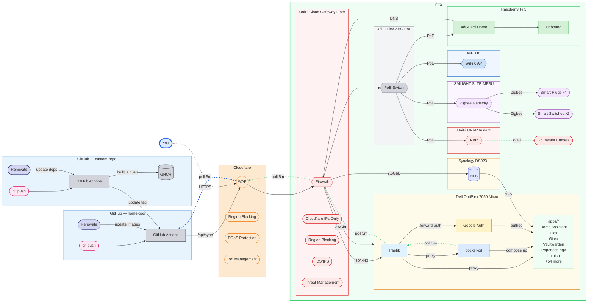

# home-ops

```mermaid
flowchart LR
    subgraph app_repo["GitHub — custom-repo"]
        app_push([git push])
        app_renovate([Renovate])
        ci[GitHub Actions]
        ghcr[(GHCR)]
    end

    subgraph ops_repo["GitHub — home-ops"]
        ops_push([git push])
        ops_renovate([Renovate])
        ops_ci[GitHub Actions]
    end

    app_push --> ci -->|build + push| ghcr
    app_renovate -->|update deps| ci
    ci -->|update tag| ops_ci
    ops_push --> ops_ci
    ops_renovate -->|update images| ops_ci
    ops_ci -->|/api/sync| cf --> unifi -->|:80/:443| traefik -->|proxy| apps

    subgraph cloudflare[Cloudflare]
        cf((WAF))
        cf_region([Region Blocking])
        cf_ddos([DDoS Protection])
        cf_bot([Bot Management])
    end

    subgraph infra[Infra]
        subgraph dell[Dell OptiPlex 7050 Micro]
            docker_cd[docker-cd] -->|compose up| apps
            traefik[Traefik] -->|proxy| docker_cd
            traefik -->|forward-auth| google_auth[Google Auth] -->|authed| apps

            apps["apps/*
            Home Assistant
            Plex
            Gitea
            Vaultwarden
            Paperless-ngx
            Immich
            +54 more"]
        end

        subgraph nas[Synology DS923+]
            nfs[(NFS)]
        end

        subgraph ucg[UniFi Cloud Gateway Fiber]
            unifi{{Firewall}}
            ucg_cf([Cloudflare IPs Only])
            ucg_region([Region Blocking])
            ucg_ids([IDS/IPS])
            ucg_threat([Threat Management])
        end

        subgraph pi[Raspberry Pi 5]
            adguard[AdGuard Home] --> unbound[Unbound]
        end

        subgraph slzb[SMLIGHT SLZB-MR3U]
            zigbee{{Zigbee Gateway}}
        end

        zigbee -->|Zigbee| plugs([Smart Plugs x4])
        zigbee -->|Zigbee| switches([Smart Switches x2])

        subgraph uswflex[UniFi Flex 2.5G PoE]
            poe{{PoE Switch}}
        end

        subgraph u6[UniFi U6+]
            ap{{WiFi 6 AP}}
        end

        subgraph unvr[UniFi UNVR Instant]
            nvr{{NVR}}
        end

        nfs -->|NFS| apps
        adguard -->|DNS| unifi
        unifi -->|2.5GbE| nfs
        unifi --> poe
        unifi -->|2.5GbE| dell
        poe -->|PoE| zigbee
        poe -->|PoE| adguard
        poe -->|PoE| ap
        poe -->|PoE| nvr
        nvr -->|WiFi| camera([G6 Instant Camera])
    end

    docker_cd -.->|poll 5m| traefik -.->|poll 5m| unifi -.->|poll 5m| cf -.->|poll 5m| ops_ci
    you([You]) -.->|HTTPS| cf

    style app_repo fill:#e8f4fd,stroke:#4a90d9
    style ops_repo fill:#e8f4fd,stroke:#4a90d9
    style infra fill:#f0fdf4,stroke:#22c55e,stroke-width:2px
    style cloudflare fill:#fde8d0,stroke:#f6821f
    style cf fill:#fde8d0,stroke:#f6821f,color:#333
    style cf_region fill:#fde8d0,stroke:#f6821f,color:#333
    style cf_ddos fill:#fde8d0,stroke:#f6821f,color:#333
    style cf_bot fill:#fde8d0,stroke:#f6821f,color:#333
    style you fill:#dbeafe,stroke:#2563eb,stroke-width:3px,color:#333
    style ucg_cf fill:#fde8e8,stroke:#dc2626,color:#333
    style ucg_region fill:#fde8e8,stroke:#dc2626,color:#333
    style ucg_ids fill:#fde8e8,stroke:#dc2626,color:#333
    style ucg_threat fill:#fde8e8,stroke:#dc2626,color:#333
    style ghcr fill:#d1d5db,stroke:#24292e,color:#333
    classDef gha fill:#d1d5db,stroke:#24292e,color:#333
    class ci,ops_ci gha
    style app_renovate fill:#d5d7f2,stroke:#1a1f6c,color:#333
    style ops_renovate fill:#d5d7f2,stroke:#1a1f6c,color:#333
    style adguard fill:#d4f0d7,stroke:#68bc71,color:#333
    style unbound fill:#d4f0d7,stroke:#68bc71,color:#333
    style unifi fill:#fde8e8,stroke:#dc2626,color:#333
    style zigbee fill:#f5e6ff,stroke:#9b59b6,color:#333
    style poe fill:#d1d5db,stroke:#6b7280,color:#333
    style ap fill:#cce0f5,stroke:#0559c9,color:#333
    style traefik fill:#e0f2fe,stroke:#0284c7,color:#333
    style docker_cd fill:#dbeafe,stroke:#2563eb,color:#333
    style google_auth fill:#fef3c7,stroke:#d97706,color:#333
    style apps fill:#f0fdf4,stroke:#16a34a,color:#333
    style nfs fill:#e0e7ff,stroke:#4f46e5,color:#333
    classDef trigger fill:#fce7f3,stroke:#db2777,color:#333
    class app_push,ops_push trigger
    style dell fill:#fffbeb,stroke:#d97706
    style nas fill:#fffbeb,stroke:#d97706
    style ucg fill:#fef2f2,stroke:#dc2626
    style pi fill:#f0fdf4,stroke:#22c55e
    style slzb fill:#faf5ff,stroke:#9b59b6
    style uswflex fill:#f3f4f6,stroke:#6b7280
    style u6 fill:#eff6ff,stroke:#0559c9
    style unvr fill:#fef2f2,stroke:#dc2626
    style nvr fill:#fde8e8,stroke:#dc2626,color:#333
    style camera fill:#fde8e8,stroke:#dc2626,color:#333
    style plugs fill:#f5e6ff,stroke:#9b59b6,color:#333
    style switches fill:#f5e6ff,stroke:#9b59b6,color:#333
    linkStyle 26 stroke:#22c55e,stroke-dasharray:5
    linkStyle 27 stroke:#22c55e,stroke-dasharray:5
    linkStyle 28 stroke:#22c55e,stroke-dasharray:5
    linkStyle 29 stroke:#22c55e,stroke-dasharray:5
    linkStyle 30 stroke:#2563eb,stroke-width:3px,stroke-dasharray:5
```

GitOps-driven homelab running on Docker Compose.

Push to git, [docker-cd](https://github.com/wajeht/docker-cd) handles the rest — auto-discovers `apps/*/`, decrypts [SOPS](https://github.com/getsops/sops) secrets, rolling deploys. [Traefik](https://traefik.io/traefik/) routes via Docker labels with wildcard SSL. [Renovate](https://github.com/renovatebot/renovate) keeps deps fresh; own images deploy in ~1 min via [docker-cd-deploy-workflow](https://github.com/wajeht/docker-cd-deploy-workflow), which updates `home-ops`, triggers docker-cd `/api/sync`, tracks GitHub Deployments, and creates/cleans temporary PR apps. [dcdb](https://github.com/wajeht/dcdb) manages databases in docker-cd Compose environments for discovery, SQL, dump/restore, prod-to-PR sync, and port forwarding.

All containers [hardened](docs/adding-apps.md#container-hardening) with dropped capabilities, resource limits, and health checks. Nightly backups to NAS via centralized [Backrest](docs/disaster-recovery.md) (restic web UI) with per-app retention, integrity checks, and ntfy alerts.

## Docs

- [Hardware](docs/hardware.md)
- [Quick Start](docs/quick-start.md)
- [Adding Apps](docs/adding-apps.md)
- [Secrets](docs/secrets.md)
- [SSL Setup](docs/ssl.md)
- [Renovate](docs/renovate.md)
- [Instant Deploy](docs/instant-deploy.md)
- [Disaster Recovery](docs/disaster-recovery.md)

## License

Distributed under the MIT License © [wajeht](https://github.com/wajeht). See [LICENSE](./LICENSE) for more information.
