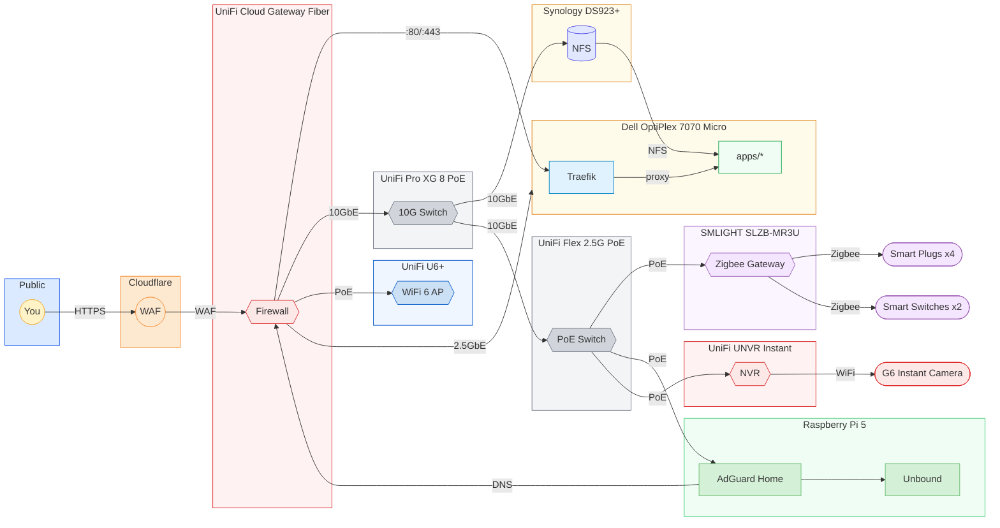

# home-ops

Homelab running on single-node [K3s](https://k3s.io) (lightweight Kubernetes).

```mermaid
flowchart LR
    subgraph public[Public]
        you((You))
    end

    subgraph cloudflare[Cloudflare]
        cf((WAF))
    end

    subgraph ucg[UniFi Cloud Gateway Fiber]
        unifi{{Firewall}}
    end

    subgraph uswproxg[UniFi Pro XG 8 PoE]
        xg{{10G Switch}}
    end

    subgraph uswflex[UniFi Flex 2.5G PoE]
        poe{{PoE Switch}}
    end

    subgraph k3s_node[Dell OptiPlex 7070 Micro]
        traefik[Traefik] -->|proxy| apps
        apps["apps/*"]
    end

    subgraph nas[Synology DS923+]
        nfs[(NFS)]
    end

    subgraph pi[Raspberry Pi 5]
        adguard[AdGuard Home] --> unbound[Unbound]
    end

    subgraph u6[UniFi U6+]
        ap{{WiFi 6 AP}}
    end

    subgraph unvr[UniFi UNVR Instant]
        nvr{{NVR}}
    end

    subgraph slzb[SMLIGHT SLZB-MR3U]
        zigbee{{Zigbee Gateway}}
    end

    you -->|HTTPS| cf -->|WAF| unifi -->|:80/:443| traefik
    nfs -->|NFS| apps
    adguard -->|DNS| unifi
    unifi -->|10GbE| xg
    xg -->|10GbE| nfs
    xg -->|10GbE| poe
    unifi -->|2.5GbE| k3s_node
    unifi -->|PoE| ap
    poe -->|PoE| zigbee
    poe -->|PoE| adguard
    poe -->|PoE| nvr
    nvr -->|WiFi| camera([G6 Instant Camera])
    zigbee -->|Zigbee| plugs([Smart Plugs x4])
    zigbee -->|Zigbee| switches([Smart Switches x2])

    style public fill:#dbeafe,stroke:#2563eb,color:#333
    style cloudflare fill:#fde8d0,stroke:#f6821f
    style cf fill:#fde8d0,stroke:#f6821f,color:#333
    style you fill:#fef3c7,stroke:#f59e0b,color:#333
    style ucg fill:#fef2f2,stroke:#dc2626
    style unifi fill:#fde8e8,stroke:#dc2626,color:#333
    style uswproxg fill:#f3f4f6,stroke:#6b7280
    style xg fill:#d1d5db,stroke:#6b7280,color:#333
    style uswflex fill:#f3f4f6,stroke:#6b7280
    style poe fill:#d1d5db,stroke:#6b7280,color:#333
    style k3s_node fill:#fffbeb,stroke:#d97706
    style traefik fill:#e0f2fe,stroke:#0284c7,color:#333
    style apps fill:#f0fdf4,stroke:#16a34a,color:#333
    style nas fill:#fffbeb,stroke:#d97706
    style nfs fill:#e0e7ff,stroke:#4f46e5,color:#333
    style pi fill:#f0fdf4,stroke:#22c55e
    style adguard fill:#d4f0d7,stroke:#68bc71,color:#333
    style unbound fill:#d4f0d7,stroke:#68bc71,color:#333
    style u6 fill:#eff6ff,stroke:#0559c9
    style ap fill:#cce0f5,stroke:#0559c9,color:#333
    style unvr fill:#fef2f2,stroke:#dc2626
    style nvr fill:#fde8e8,stroke:#dc2626,color:#333
    style camera fill:#fde8e8,stroke:#dc2626,color:#333
    style slzb fill:#faf5ff,stroke:#9b59b6
    style zigbee fill:#f5e6ff,stroke:#9b59b6,color:#333
    style plugs fill:#f5e6ff,stroke:#9b59b6,color:#333
    style switches fill:#f5e6ff,stroke:#9b59b6,color:#333
```

## Docs

- [Hardware](docs/hardware.md)
- [K3s](docs/k3s.md)

## License

Distributed under the MIT License © [wajeht](https://github.com/wajeht). See [LICENSE](./LICENSE) for more information.
