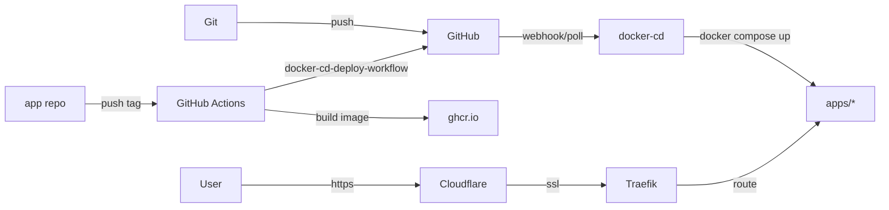

# home-ops

GitOps-driven homelab running on Docker Compose

## Overview

Push to git, [docker-cd](https://github.com/wajeht/docker-cd) auto-deploys. Auto-discovers all stacks in `apps/`, decrypts SOPS secrets, and deploys with rolling updates. [Traefik](https://traefik.io) routes with auto SSL via Cloudflare. Secrets encrypted with [SOPS](https://github.com/getsops/sops). [Renovate](https://github.com/renovatebot/renovate) keeps third-party deps updated. Own images use [docker-cd-deploy-workflow](https://github.com/wajeht/docker-cd-deploy-workflow) for instant deploy (~1min vs Renovate's ~15min).

## Hardware

| Device | RAM | Storage | OS | Function |
|--------|-----|---------|----|---------|
| [Dell OptiPlex 5050 Micro](https://www.amazon.com/s?k=dell+optiplex+5050+micro) | 32GB | 1TB SSD | Ubuntu 24.04 | Docker Host |
| [Raspberry Pi 5 + PoE HAT](https://www.raspberrypi.com/products/raspberry-pi-5/) | 8GB | 128GB SD | Raspberry Pi OS | AdGuard |
| [Synology DS923+](https://www.amazon.com/dp/B0BM7KDN6R) &nbsp;&nbsp;&nbsp;&nbsp;— [WD Red Plus 8TB](https://www.amazon.com/s?k=WD+Red+Plus+8TB) x2 &nbsp;&nbsp;&nbsp;&nbsp;— [Seagate IronWolf 12TB](https://www.amazon.com/s?k=Seagate+IronWolf+12TB) x2 | 4GB | 25TB SHR | DSM | NAS |
| [UniFi Cloud Gateway Ultra](https://store.ui.com/us/en/products/ucg-ultra) | 3GB | 16GB | UniFi OS | Firewall |
| [UniFi U6+](https://store.ui.com/us/en/products/u6-plus) | - | - | - | WiFi 6 AP |
| [TP-Link TL-SG608P](https://www.amazon.com/s?k=TP-Link+TL-SG608P) | - | - | - | PoE Switch |
| [CyberPower 1500VA AVR](https://www.amazon.com/CyberPower-CP1500AVRLCD-Intelligent-Outlets-Mini-Tower/dp/B000FBK3QK) | - | - | - | UPS |

With all equipment connected: 69W idle @ 120V, 145 min UPS runtime, 50 kWh/mo (~$6/mo).

## Docs

- [Quick Start](docs/quick-start.md)
- [Adding Apps](docs/adding-apps.md)
- [Secrets](docs/secrets.md)
- [SSL Setup](docs/ssl.md)
- [Renovate](docs/renovate.md)
- [Instant Deploy](docs/instant-deploy.md)
- [Disaster Recovery](docs/disaster-recovery.md)

## License

Distributed under the MIT License © [wajeht](https://github.com/wajeht). See [LICENSE](./LICENSE) for more information.
