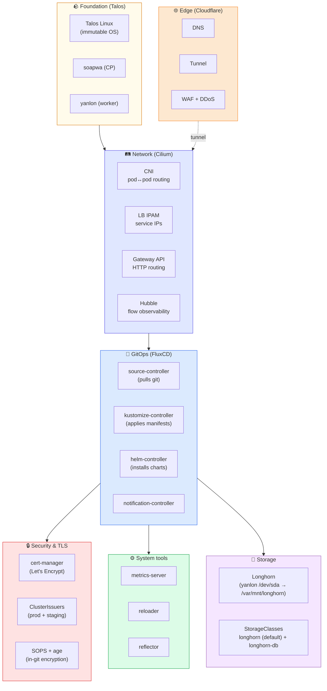
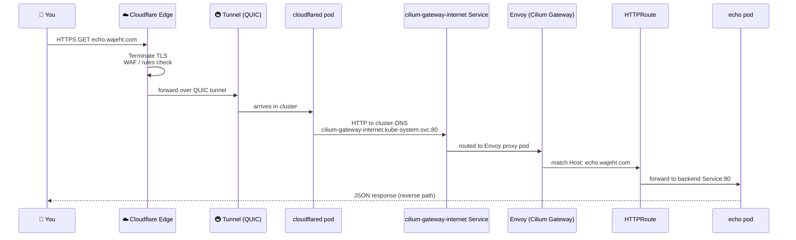
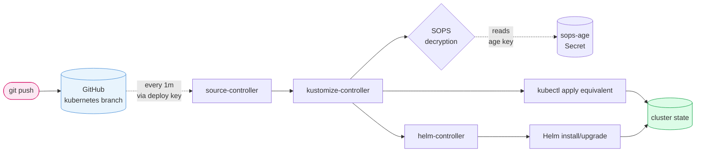
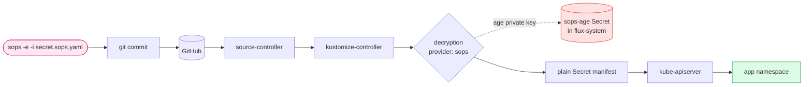
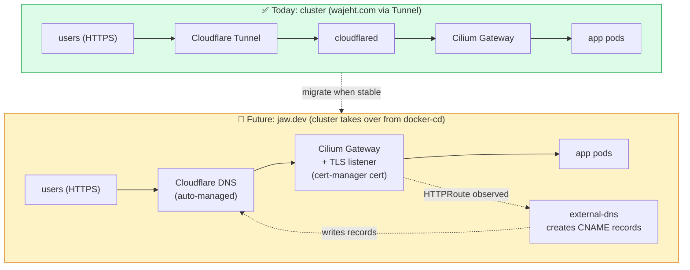

# Architecture

The full picture of how every component ties together, why each exists, and how a request flows from your laptop to a pod and back.

## The 30-second pitch

Talos + Cilium + Flux + Cloudflare Tunnel = a homelab Kubernetes cluster where:

- The OS, control plane, and networking are immutable and declarative
- Every change is a git commit (no kubectl from your laptop after bootstrap)
- Apps reach the internet through Cloudflare without exposing your home IP
- Secrets are encrypted in git, decrypted by Flux inside the cluster
- Backups, certs, and DNS work without manual intervention per app

## What's installed today



## Why each piece exists

| Layer          | Component          | Job                                        | What happens without it                                |
| -------------- | ------------------ | ------------------------------------------ | ------------------------------------------------------ |
| **OS**         | Talos              | Immutable, k8s-only OS                     | Manual OS patching, drift, ssh-induced bugs            |
| **OS**         | talhelper          | Declarative Talos config                   | Hand-editing machine configs per node                  |
| **Networking** | Cilium CNI         | Pod-to-pod routing                         | Pods can't talk; nothing works                         |
| **Networking** | Cilium LB IPAM     | Assigns IPs to LoadBalancer services       | Services stuck Pending external IP                     |
| **Networking** | Cilium Gateway API | HTTP/HTTPS routing into the cluster        | Need ingress-nginx (EOL'd March 2026) + MetalLB        |
| **Networking** | Hubble             | Observe pod flows                          | Blind to network problems                              |
| **GitOps**     | FluxCD             | Reconciles cluster from git                | Back to `kubectl apply` for everything                 |
| **Edge**       | Cloudflare Tunnel  | Outbound-only entry to cluster             | Expose home IP, manage port forwards, dynamic DNS      |
| **Edge**       | cloudflared        | The tunnel client in-cluster               | Tunnel has nowhere to land                             |
| **Security**   | cert-manager       | Issues TLS certs from Let's Encrypt        | Manually request/renew certs                           |
| **Security**   | SOPS + age         | Encrypts secrets in git                    | Either secrets in plaintext or out-of-band secret mgmt |
| **System**     | metrics-server     | `kubectl top` + HPA                        | No CPU/memory visibility                               |
| **System**     | reloader           | Restart pods on Secret/ConfigMap change    | Manually bounce pods after edits                       |
| **System**     | reflector          | Copy Secrets across namespaces             | Re-encrypt the same secret per namespace               |
| **Storage**    | Longhorn           | Block storage for PVCs                     | Stateful apps can't persist data                       |
| **Storage**    | Talos UserVolume   | Mounts data disk into Talos's immutable FS | Longhorn has no path to write to                       |

## How a request reaches an app (the 8-hop traceable chain)

This is what we just proved works with `echo.wajeht.com`:



## The GitOps loop

What happens when you `git push`:



**Reconciliation interval:** Flux re-checks git every 1 min. Apps reconcile every 30 min. Force immediately with `make flux-reconcile`.

## Secrets flow



**The `sops-age` Secret is the only manually-created secret in the cluster.** Everything else is committed encrypted and decrypted inside.

## How Cloudflare Tunnel ties in

Cloudflare Tunnel solves the "homelab without exposing your IP" problem. The architecture:

- **No port forwards.** cloudflared makes an **outbound** QUIC connection to Cloudflare's edge. Nothing on your LAN listens externally.
- **DNS is automatic.** When you add a Public Hostname route (`echo.wajeht.com → cilium-gateway-internet.kube-system.svc:80`), Cloudflare creates a CNAME for you.
- **TLS is at the edge.** Cloudflare terminates HTTPS. Inside the tunnel/cluster, traffic is plain HTTP. No need for in-cluster certs (cert-manager is for other use cases — see below).
- **Failover.** Two `cloudflared` replicas, anti-affinity to spread across nodes. Either pod going down still leaves the tunnel up via the other.

## Two distinct cert-manager use cases

cert-manager is installed but only ONE of these is needed for the Cloudflare Tunnel path:

| Use case                                      | Need cert-manager?      | Where the cert lives                                              |
| --------------------------------------------- | ----------------------- | ----------------------------------------------------------------- |
| **HTTPS at Cloudflare edge** (current)        | No                      | Cloudflare's universal SSL handles it; in-cluster traffic is HTTP |
| **HTTPS between cloudflared and Gateway**     | Optional (zero-trust)   | A `Certificate` resource for the Gateway listener                 |
| **HTTPS for direct-LAN apps** (no Cloudflare) | Yes                     | Same `Certificate` resource                                       |
| **mTLS between pods**                         | Yes (or Cilium does it) | Per-Service `Certificate`                                         |

For our current setup, **cert-manager is parked** — wired up and ready for when we need it (jaw.dev migration below).

## Current state vs. planned



### When we migrate jaw.dev to the cluster

Once the cluster is proven stable and we've decommissioned docker-cd, we'll:

1. **Install external-dns** (talks to Cloudflare API)
2. **Wire it to watch HTTPRoutes** — for each HTTPRoute with a hostname, external-dns auto-creates a Cloudflare DNS record
3. **Decide on the routing path**:
   - **Path A: Continue with Cloudflare Tunnel** — external-dns becomes mostly cosmetic since the tunnel already auto-creates records. Skip it.
   - **Path B: Switch to direct port-forward** (matches your current jaw.dev setup) — external-dns creates CNAMEs to a static record `home.jaw.dev → <WAN_IP>` (maintained by something like ddns-updater).
4. **Issue certs** via cert-manager for `*.jaw.dev` on the Gateway listener
5. **Update Cilium Gateway** with the TLS listener using the issued Certificate

We're not deciding this yet — depends on how the cluster proves itself with `*.wajeht.com` first.

## Mental model: each component as a port-role

(For people who think in physical metaphors)

| Component          | Port role                                                                                 |
| ------------------ | ----------------------------------------------------------------------------------------- |
| Talos              | The port itself — docks, basic rails                                                      |
| Cilium CNI         | The rail network connecting every dock                                                    |
| Cilium Gateway API | The customs gate — reads truck manifests (Host headers) and routes                        |
| Cilium LB IPAM     | The pier-number sign maker                                                                |
| Cloudflare Tunnel  | A diplomatic pouch — secured channel to/from outside, no public entrance                  |
| cloudflared        | The diplomatic courier on your side                                                       |
| FluxCD             | The harbormaster's standing orders — reads the playbook (git) and makes the port match it |
| SOPS               | A locked filing cabinet that only the harbormaster can open                               |
| cert-manager       | The notary public — issues authenticated TLS certificates on request                      |
| Cloudflare edge    | The harbor's outer breakwater and customs check                                           |
| Cilium Hubble      | The traffic camera over every dock                                                        |

## What's NOT installed yet (and why each matters)

| Component                           | When to add                        | What it unlocks                                  |
| ----------------------------------- | ---------------------------------- | ------------------------------------------------ |
| **nfs-subdir-external-provisioner** | When apps need big shared storage  | Bulk media on Synology NAS                       |
| **CloudNativePG**                   | Before any Postgres-backed app     | Postgres clusters as a CRD (no per-app DB ops)   |
| **Volsync**                         | Before any data we care about      | Restic-based PVC backups + restore-on-PVC-create |
| **oauth2-proxy**                    | Before exposing admin apps         | Google forward-auth replacement                  |
| **node-feature-discovery**          | When adding GPU/specialty hardware | Labels nodes by features                         |
| **intel-device-plugin**             | Before Plex                        | Exposes Intel iGPU for transcoding               |
| **kube-prometheus-stack**           | When you want graphs               | Prometheus + Grafana + Alertmanager              |
| **kromgo**                          | When you want README badges        | Exposes cluster metrics as shields.io endpoints  |
| **system-upgrade-controller**       | After cluster is stable            | Auto-upgrades Talos via CRDs                     |
| **external-dns**                    | When migrating jaw.dev (see above) | Auto-creates Cloudflare records from HTTPRoutes  |

## Files-to-running-state map

```
home-ops repo on disk
    ↓ git push
GitHub (kubernetes branch)
    ↓ Flux source-controller pulls (~1m)
in-cluster Flux Kustomizations
    ↓ for each path, kustomize build
generated manifests
    ↓ kubectl apply (via kustomize-controller)
running resources in the cluster
    ↓ pods, services, gateways, etc.
your apps responding on the internet
```

For the per-app pattern (the actual files), see [adding-apps.md](adding-apps.md).

## Operational dependency order

If you ever do a full cluster rebuild, this is the order things must come up in:

```
1. Talos (the OS itself)
2. Kubernetes control plane (etcd, apiserver, etc. — bootkube)
3. Cilium (CNI — nothing else can run without it)
4. CoreDNS (depends on CNI)
5. Flux (bootstrap manually — chicken-and-egg with git)
6. sops-age Secret (manually created — chicken-and-egg with SOPS)
7. metrics-server, reloader, reflector (foundation tools)
8. cert-manager (before issuers)
9. cert-manager-issuers (depends on cert-manager + sops decryption)
10. Cilium Gateway + LB IPPool (before routing anything)
11. cloudflared (before exposing apps)
12. Longhorn (UserVolume must exist on the node first)
13. (Future: CNPG, Volsync — before stateful apps)
13. Apps
```

Most of this is automated via `dependsOn` in Flux Kustomizations. The only manual steps are #1, #5, and #6.

## References

- [getting-started.md](getting-started.md) — step-by-step bootstrap playbook
- [adding-apps.md](adding-apps.md) — the per-app GitOps pattern
- [talos.md](talos.md) — Talos cluster cheatsheet
- [cilium.md](cilium.md) — Cilium install deep dive
- [flux.md](flux.md) — FluxCD bootstrap + workflow
- [kubernetes.md](kubernetes.md) — full stack table + migration plan
