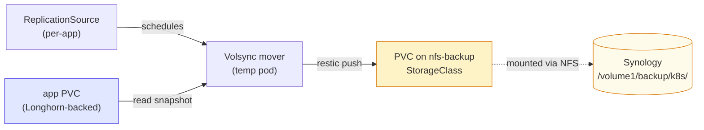

# NFS Storage (nfs-subdir-external-provisioner)

Dynamic PV provisioner backed by the Synology NFS share at `192.168.4.243:/volume1/backup`. Creates a subdirectory per PVC under `/volume1/backup/k8s/` so docker-cd's existing borgmatic data in `/volume1/backup/<app>/` stays untouched.

## Why this and not just static NFS volumes

| Approach                          | Pros                                                                                    | Cons                                              |
| --------------------------------- | --------------------------------------------------------------------------------------- | ------------------------------------------------- |
| **nfs-subdir provisioner** (this) | Each PVC gets a unique subdir automatically; standard k8s `PersistentVolumeClaim` works | One extra Deployment                              |
| Static `PersistentVolume` per app | No extra components                                                                     | Hand-allocate paths, lots of YAML, doesn't scale  |
| Mounting NFS directly in pods     | Simplest                                                                                | No quota, no GitOps PVC pattern, awkward to share |

Every homelab with a NAS uses the dynamic provisioner. It's a tiny controller — one Deployment, no state.

## What's installed

```
kubernetes/apps/nfs-backup/
├── ks.yaml
└── app/
    ├── kustomization.yaml
    ├── namespace.yaml               # `storage` namespace
    ├── helmrepository.yaml          # kubernetes-sigs/nfs-subdir-external-provisioner
    └── helmrelease.yaml             # chart v4.0.18
```

## StorageClass: `nfs-backup`

| Setting           | Value                                            | Why                                                                                |
| ----------------- | ------------------------------------------------ | ---------------------------------------------------------------------------------- |
| `defaultClass`    | `false`                                          | Longhorn stays the default for general PVCs; this is opt-in                        |
| `reclaimPolicy`   | `Retain`                                         | **Never** auto-delete backup data when a PVC is deleted                            |
| `archiveOnDelete` | `true`                                           | If a PVC is deleted, the dir is renamed (prefixed `archived-`) rather than removed |
| `pathPattern`     | `k8s/${.PVC.namespace}-${.PVC.name}-${.PVC.uid}` | All PVCs land under `/volume1/backup/k8s/` to separate from docker-cd's data       |

## What the subdir layout looks like on Synology

```
/volume1/backup/                    (existing NFS export)
├── miniflux/                       ← docker-cd borgmatic (unchanged)
├── plausible/                      ← docker-cd borgmatic (unchanged)
├── hello-world/                    ← docker-cd borgmatic (unchanged)
└── k8s/                            ← created by the provisioner
    ├── volsync-system-restic-data-<uid>/
    ├── hello-world-restic-<uid>/
    └── ...
```

## How Volsync uses this (the full backup chain)



Each app's `ReplicationSource` references a Secret with the Restic repo URL pointing at a PVC on the `nfs-backup` StorageClass. The provisioner creates a subdir under `/volume1/backup/k8s/` automatically.

## Per-app Volsync pattern (with NFS backend)

For any stateful app you want backed up:

1. **A small PVC** on the `nfs-backup` StorageClass to hold the Restic repo:

   ```yaml
   apiVersion: v1
   kind: PersistentVolumeClaim
   metadata:
     name: hello-world-restic-data
     namespace: hello-world
   spec:
     storageClassName: nfs-backup
     accessModes: [ReadWriteOnce]
     resources:
       requests:
         storage: 50Gi # max restic repo size (deduplicated, holds many snapshots)
   ```

2. **A Secret** with the Restic config:

   ```yaml
   apiVersion: v1
   kind: Secret
   metadata:
     name: hello-world-restic
     namespace: hello-world
   stringData:
     RESTIC_REPOSITORY: /repo
     RESTIC_PASSWORD: <long-random-string> # SOPS-encrypted
   ```

3. **A ReplicationSource** that mounts the NFS PVC at `/repo`:
   ```yaml
   apiVersion: volsync.backube/v1alpha1
   kind: ReplicationSource
   metadata:
     name: hello-world
     namespace: hello-world
   spec:
     sourcePVC: hello-world-data
     trigger:
       schedule: "0 3 * * *"
     restic:
       pruneIntervalDays: 7
       repository: hello-world-restic
       retain:
         daily: 7
         weekly: 4
         monthly: 6
       copyMethod: Snapshot
       storageClassName: longhorn
       # Mount the NFS-backed PVC into the mover pod as /repo
       moverConfig:
         moverPVCs:
           - name: hello-world-restic-data
             mountPath: /repo
   ```

When the cron fires:

- Volsync creates a snapshot of the Longhorn PVC
- Spins up a mover pod, mounts the snapshot + the NFS PVC
- Runs `restic backup` writing to `/repo` (which is on Synology via NFS)
- Tears down the mover pod

For restore, swap `ReplicationSource` for `ReplicationDestination` with the same Secret.

## Synology side: what needs to exist

- NFS service enabled (Control Panel → File Services → NFS)
- The `/volume1/backup` share exported (it is — docker-cd already uses it)
- **NFS export rules for each cluster node** (Control Panel → Shared Folder → `backup` → Edit → NFS Permissions):
  - `192.168.4.162` (soapwa) — Read/Write, Squash: Map all users to admin, Security: sys
  - `192.168.4.163` (yanlon) — same
  - A single `192.168.4.0/24` rule works too, but DSM applies the first-matching rule, so check the order if an existing docker-cd rule is more restrictive
- Squash to admin (or no_root_squash) so the provisioner can `chmod`/`mkdir`

If mounts fail with `access denied by server`, the export rule is missing or doesn't cover the node IP — that was the symptom we hit during bootstrap.

## Resizing / archiving

- **Resize a PVC**: edit `spec.resources.requests.storage` on the PVC. nfs-subdir doesn't actually enforce quotas (NFS doesn't have per-dir quotas without DSM volume-level setup), so resizes are a soft contract.
- **Delete cleanly**: `kubectl delete pvc <name>` — the subdir gets renamed `archived-<original-name>` on Synology (because of `archiveOnDelete: true`). Wipe it manually if you don't want it.

## Future: separate provisioner for media (Plex)

When we migrate Plex, we'll install a **second** nfs-subdir-external-provisioner pointing at `/volume1/Media` (or wherever your Plex library lives) with a separate StorageClass `nfs-media`. The pattern is the same — just different release name + NFS path.

For now: backups only.

## Troubleshooting

### PVC stuck Pending with no events

The provisioner pod might be CrashLooping. Check:

```bash
kubectl -n storage logs -l app=nfs-subdir-external-provisioner --tail=30
```

Common causes: NFS path doesn't exist, NFS export doesn't allow the node IPs, firewall blocks port 2049.

### PVCs land in the wrong subdirectory

The `pathPattern` is fixed in the HelmRelease values. Edit + push to change; existing PVCs keep their original paths.

### "no such file or directory" mounting NFS in a pod

The node's NFS client packages aren't installed. **Talos's `util-linux-tools` extension handles this** — confirm via `talosctl get extensions`.

## References

- [nfs-subdir-external-provisioner repo](https://github.com/kubernetes-sigs/nfs-subdir-external-provisioner)
- [Helm chart docs](https://github.com/kubernetes-sigs/nfs-subdir-external-provisioner/tree/master/charts/nfs-subdir-external-provisioner)
- [Volsync with NFS repo example](https://volsync.readthedocs.io/en/stable/usage/restic/index.html)
