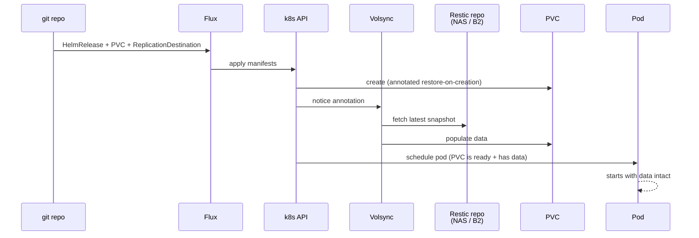

# Volsync

PVC backup + restore operator. Snapshots persistent volumes on a schedule and ships the data to a Restic repository. Crucially, it can **auto-restore data on first PVC creation** — making cluster rebuilds painless.

## Why Volsync over Longhorn's own backup

| Tool                  | Pros                                                                                  | Cons                                                         |
| --------------------- | ------------------------------------------------------------------------------------- | ------------------------------------------------------------ |
| **Volsync**           | k8s-native (CRDs), restore-on-PVC-create, works with any CSI volume, dedup via Restic | Extra component to install                                   |
| Longhorn backup-to-S3 | Built into Longhorn UI                                                                | Only works with Longhorn volumes; no auto-restore on new PVC |
| Velero                | Cluster-level (whole namespaces)                                                      | Heavy, app-level granularity is awkward                      |
| Stash                 | Mature                                                                                | Smaller community, less GitOps-friendly                      |

For homelab GitOps, **Volsync** is the dominant choice (onedr0p, bjw-s, joryirving all use it).

## What it gives us

```
Day 1: write app HelmRelease + Volsync ReplicationSource
  → Volsync snapshots PVC every night to Restic repo (NAS or B2 or S3)

Day 365: cluster dies, full rebuild
  → re-apply manifests from git
  → Volsync sees the ReplicationDestination annotation
  → auto-restores last snapshot into the new PVC BEFORE the pod starts
  → app comes up with data intact
```

Compare to docker-cd's borgmatic: same data flow, but Volsync is cluster-aware and triggered by k8s events instead of cron + manual restore.

## Prerequisites

- Cluster bootstrapped through Longhorn (or any other CSI provider) — Volsync needs a CSI snapshot-capable storage class
- A backup destination (we'll set this up per-app when migrating)

## Backup destinations

Volsync's Restic mover can write to:

| Backend                                  | URL prefix                   | Setup effort                         | Best for                               |
| ---------------------------------------- | ---------------------------- | ------------------------------------ | -------------------------------------- |
| **NFS PVC** (via nfs-subdir-provisioner) | `local:/data` mounted to NFS | Need nfs-subdir-external-provisioner | Our Synology NAS — most homelab-native |
| **SFTP to Synology**                     | `sftp:user@host:/path`       | Generate SSH key, add to Synology    | Simple, no extra k8s components        |
| **Backblaze B2**                         | `b2:bucket:path`             | Sign up for B2 (10GB free)           | Off-site, automatic                    |
| **S3 / Cloudflare R2**                   | `s3:url/bucket`              | S3 API credentials                   | If you already have an S3              |

**We use NFS PVC** via the `nfs-backup` StorageClass — see [nfs-storage.md](nfs-storage.md). Each app gets a small Restic-repo PVC on `/volume1/backup/k8s/<ns>-<pvc>/`, and Volsync writes there with `RESTIC_REPOSITORY=/repo`.

## Layout

```
kubernetes/apps/volsync-system/volsync/
├── ks.yaml                          # Flux Kustomization
└── app/
    ├── kustomization.yaml
    ├── namespace.yaml               # volsync-system
    ├── helmrepository.yaml          # backube/helm-charts
    └── helmrelease.yaml             # volsync v0.15.0, CRDs managed
```

## Per-app pattern (for future stateful apps)

Each app that needs backups gets:

1. **A `ReplicationSource`** — defines what to back up, where, and how often:

   ```yaml
   apiVersion: volsync.backube/v1alpha1
   kind: ReplicationSource
   metadata:
     name: hello-world
     namespace: hello-world
   spec:
     sourcePVC: hello-world-data
     trigger:
       schedule: "0 3 * * *" # 3 AM nightly
     restic:
       pruneIntervalDays: 7
       repository: hello-world-restic # references a Secret with repo URL + password
       retain:
         daily: 7
         weekly: 4
         monthly: 6
       copyMethod: Snapshot # via Longhorn snapshots (point-in-time)
       storageClassName: longhorn
   ```

2. **A `Secret`** (SOPS-encrypted) with the Restic repo URL + encryption password:

   ```yaml
   apiVersion: v1
   kind: Secret
   metadata:
     name: hello-world-restic
     namespace: hello-world
   stringData:
     RESTIC_REPOSITORY: nfs:/mnt/restic-backups/hello-world
     RESTIC_PASSWORD: <long-random-string>
   ```

3. **An annotation on the PVC** so restore happens on first create:
   ```yaml
   metadata:
     annotations:
       volsync.backube/restore-on-creation: "true"
       volsync.backube/restore-source: hello-world # name of ReplicationDestination
   ```

The `ReplicationDestination` (counterpart resource) pairs with the source for restores. It's similar — same secret, same restic repo, but `kind: ReplicationDestination`.

## Disaster recovery flow



## What's set up vs not

- ✅ Volsync operator installed
- ✅ Backup destination: `nfs-backup` StorageClass (Synology `/volume1/backup/k8s/`)
- ❌ No `ReplicationSource` resources yet (added per stateful app — see [nfs-storage.md](nfs-storage.md) for the per-app pattern)
- ❌ No `RESTIC_PASSWORD` secrets yet (generated per app, SOPS-encrypted)

## Useful commands

```bash
# All ReplicationSources across the cluster
kubectl get replicationsources -A

# Trigger an immediate backup
kubectl annotate -n <ns> replicationsource <name> \
  volsync.backube/manual-trigger="$(date +%s)" --overwrite

# Check last successful backup time
kubectl get replicationsource -n <ns> <name> -o yaml | grep lastSync

# Check Volsync operator logs
kubectl -n volsync-system logs -l app.kubernetes.io/name=volsync --tail=50
```

## Trade-offs vs docker-cd's borgmatic

|                   | borgmatic (docker-cd)                              | Volsync                                            |
| ----------------- | -------------------------------------------------- | -------------------------------------------------- |
| Backup tool       | Borg                                               | Restic                                             |
| Trigger           | Cron in container                                  | k8s CronJob (built into Volsync)                   |
| Restore           | Manual: `docker exec ... borgmatic extract` + copy | Automatic on PVC create                            |
| Multi-app         | One borgmatic container per app                    | One Volsync controller, N `ReplicationSource` CRDs |
| Repo format       | Borg (separate format)                             | Restic (separate format)                           |
| Cluster migration | Re-attach `~/data/<app>` to new host               | Re-apply manifests, data auto-restores             |

Migration plan: when each docker-cd app moves to k8s, do a one-time data sync:

1. Borgmatic snapshots last good state on docker-cd
2. Move data files into the new PVC (via NFS or kubectl cp)
3. Volsync takes over going forward

## References

- [Volsync docs](https://volsync.readthedocs.io/)
- [bjw-s Volsync HelmRelease](https://github.com/bjw-s/home-ops/tree/main/kubernetes/apps/system/volsync)
- [Restic docs](https://restic.readthedocs.io/)
